# Tutorial 1: KSoR — One Governed Knowledge Record for Humans and AI Agents

A **Knowledge System of Record (KSoR)** is an authoritative and governed knowledge layer that humans, AI agents, and software can all use.

That sounds technical, but the basic idea is simple:

> **An AI agent may be able to find information, but it cannot reliably know which information your organization considers official.**

Your organization has to make that decision.

A KSoR gives AI systems a trusted place to find the knowledge they are expected to use.

In this tutorial, you will learn:

- why AI agents can give different answers to the same question,
- why this is more than a search or RAG problem,
- how a KSoR differs from a traditional System of Record,
- the eight core ideas behind KSoR,
- what belongs inside a KSoR,
- how governance, provenance, citation, and abstention work,
- how the same governed knowledge can serve humans and AI agents,
- and how to create your first KSoR project.

At the end, you will build a small KSoR locally.

> 🎥 This tutorial follows the live introduction session:
> [KSoR — Introduction and the Eight Concepts (YouTube)](https://www.youtube.com/watch?v=EeTGuQJbHCg)

---

## What you will learn

By the end of this tutorial, you should be able to explain:

- why AI agents can give different answers to the same question,
- why those differences can be dangerous,
- how a KSoR differs from a traditional System of Record,
- why an AI-native organization may need both,
- the eight concepts behind the KSoR mental model,
- what belongs inside a KSoR and what does not,
- how governance determines what an agent may use,
- why important answers should include citations,
- why an AI agent must sometimes say **"I don't know,"**
- and how to create and run your first KSoR.

---

# 1. Start with the problem: three AI helpers, three answers

Imagine a hospital uses three different AI helpers.

A nurse asks all three the same question:

> **"How much medicine is safe for a six-year-old?"**

The first AI gives one amount.

The second gives a different amount.

The third gives yet another amount.

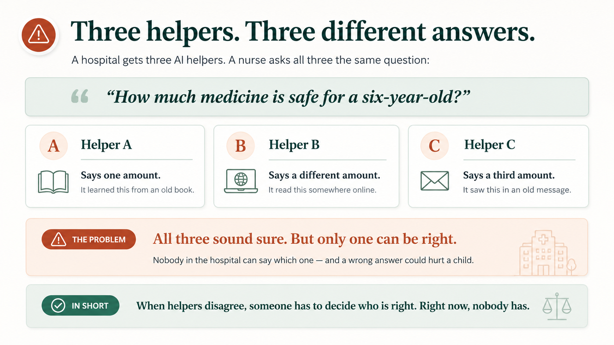

All three answers sound confident.

Why?

Because each AI may be using different information.

One might be relying on:

- an old medical book,
- a hospital wiki,
- something it found online,
- an old chat message,
- an outdated policy,
- or information remembered by the language model itself.

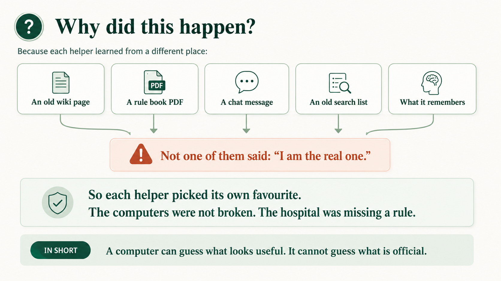

The problem is not that the AI systems are unable to find information.

They can find plenty of information.

The problem is that they do not know **which information the hospital considers authoritative**.

None of the documents automatically says:

> "I am the official hospital policy. If another source disagrees with me, use me."

That decision has to come from the hospital.

So the real problem is not simply a **search problem**.

It is an **authority problem**.

> **A computer can guess what looks relevant. It cannot guess what your organization has officially approved.**

The organization must decide:

> **Which knowledge are we willing to operate from?**

That is the problem KSoR is designed to solve.

---

# 2. Why AI helpers disagree

There are four important reasons AI systems can disagree.

## Reason 1 — LLMs are probabilistic

Large Language Models are not ordinary deterministic programs.

If you ask the same model the same question several times, it may answer differently.

One response may use one example or reasoning path, while another uses a different one.

This flexibility is useful.

But it becomes dangerous when the subject is something that should not change, such as:

- company policy,
- medical rules,
- accounting policy,
- approval limits,
- course requirements,
- legal procedures.

---

## Reason 2 — Training data can be wrong

AI models are trained on enormous collections of information.

Some of that information is:

- correct,
- incorrect,
- outdated,
- incomplete,
- or contradictory.

If incorrect information existed in the training material, a model may repeat it confidently.

The introduction session gives a real example: a frontier model confidently attributed a famous Urdu poem to the wrong book because an incorrect web page had published that information.

The model sounded confident.

The source was still wrong.

---

## Reason 3 — LLMs can hallucinate

Sometimes a model does not have enough information to answer a question.

Instead of stopping, it may generate something that sounds reasonable.

For example, it might invent:

- a policy that was never approved,
- a medicine that does not exist,
- a rule that nobody wrote,
- or a procedure that sounds plausible but is not official.

This is called **hallucination**.

---

## Reason 4 — Your organization's knowledge is private and constantly changing

A foundation model cannot be assumed to know your organization's current internal knowledge.

For example, it cannot automatically know:

- your company's latest travel policy,
- your hospital's approved dosage rules,
- your university's current curriculum,
- your accounting department's capitalization policy,
- or which version of a procedure is currently in force.

Even if the model has seen *some version* of that information, it does not know whether that version is the one your organization currently recognizes as authoritative.

---

## What this means

If an organization wants predictable AI behavior, it needs a governed source of knowledge that tells AI agents:

> **This is the knowledge you are allowed to operate from.**

That is the role of a KSoR.

---

# 3. Organizations already have two kinds of truth

The term **System of Record** is not new.

Organizations have used Systems of Record for decades.

For example:

- an accounting system records financial transactions,
- a CRM records customers and sales opportunities,
- an HRIS records employees,
- a university system records enrollments and grades.

If a spreadsheet says a customer owes $10,000 but the accounting ledger says $12,000, the ledger normally wins.

Why?

Because the accounting system has been designated as the authoritative system.

These systems mainly answer:

> **What is true right now?**

Examples include:

- What is the customer's current balance?
- How many products are in inventory?
- Which invoices are unpaid?
- Which students are enrolled?
- How much cash is in the bank?

These are questions about **state**.

---

## But organizations also depend on knowledge

Organizations have always had another kind of information.

They have:

- policy manuals,
- procedure manuals,
- textbooks,
- operating guides,
- standards,
- rules,
- methods,
- and human expertise.

For example, an experienced accountant may know:

- which accounting policy applies,
- when an expense may be capitalized,
- which approvals are required,
- what exceptions exist,
- and when human judgment is required.

That knowledge tells people:

> **How should we operate?**

Traditionally, this knowledge was written mainly for humans.

AI agents change that.

AI agents are increasingly being asked to perform work that humans once performed.

Those agents need both **current state** and **operating knowledge**.

| Type | What it holds | Main question |
| --- | --- | --- |
| Traditional System of Record | Current operational data | **What is true right now?** |
| Knowledge System of Record | Rules, methods, policies, procedures | **How should we operate?** |

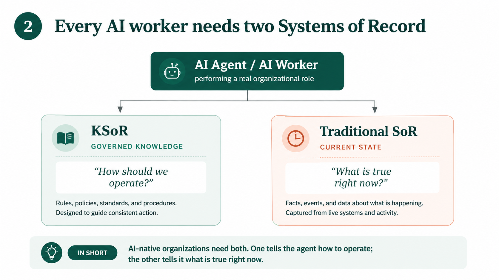

For example:

> **A traditional System of Record tells the agent what is happening. A Knowledge System of Record tells the agent how the organization says it should operate.**

An AI-native organization needs both.

---

# 4. "But hasn't the model already read every textbook?"

This is a reasonable question.

Modern frontier models have been trained on enormous amounts of public educational and professional material.

So why give an AI agent a specific textbook or knowledge base?

Because there is a major difference between **capability** and **authority**.

---

## Capability is not authority

A powerful model may be capable of designing a good AI course.

But it cannot decide:

> **What is this institution's official AI course?**

The institution still has to decide:

- the learning objectives,
- the course sequence,
- the canonical material,
- the assessment rules,
- the grading policy,
- and the version currently in use.

Ask several AI models:

> "How should I learn to build an AI agent?"

You may get several excellent answers.

But those answers may recommend different:

- frameworks,
- tools,
- sequences,
- examples,
- and levels of depth.

Any of them might be reasonable.

None becomes **your institution's curriculum** until the institution designates it as such.

---

## Consistency requires an authoritative source

This becomes especially important in education.

Imagine two students taking the same course.

Student A's AI tutor teaches one set of concepts.

Student B's AI tutor teaches a different set.

Both explanations may be individually reasonable.

But now the institution no longer has one curriculum.

Personalization has quietly turned into inconsistency.

Panaversity experienced this problem when major AI labs introduced study modes. Different AI tutors could start students at different places and teach the same subject at different depths.

Each approach could be defensible.

But the institution still needed one authoritative curriculum.

---

## Learning also needs a record

An educational institution actually needs two different systems of record.

### 1. Knowledge SoR

The governed curriculum and textbook.

For Panaversity, an example is [The AI Agent Factory](https://agentfactory.panaversity.org/).

### 2. Learner SoR

A system that records:

- who the learner is,
- what the learner has completed,
- what the learner is currently studying,
- and how far the learner has progressed.

The Knowledge SoR governs **what is taught**.

The learner SoR records **what has happened with the learner**.

---

# 5. The eight concepts behind KSoR

The easiest way to understand KSoR is through eight simple ideas.

We will continue using the hospital example.

Each concept answers one question.

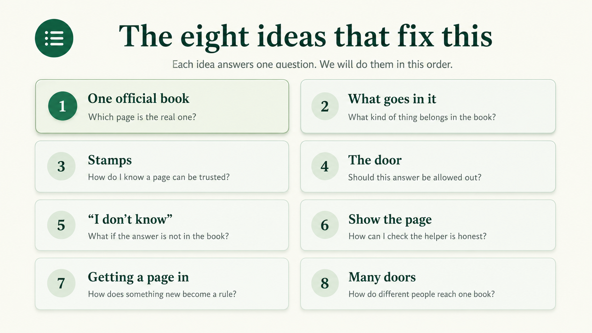

---

## Concept 1 — One official book

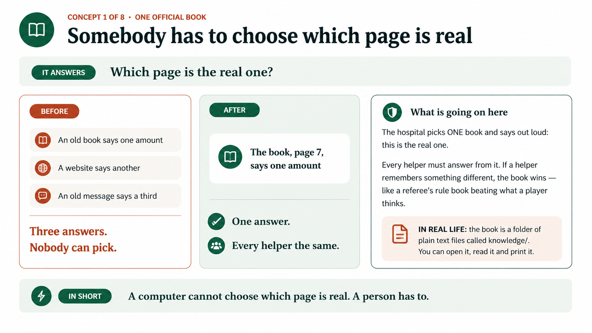

### Question

**Which page is the real one?**

Imagine the hospital has many documents containing medication rules.

Someone has to decide which one is official.

So the hospital selects one governed record and says:

> **This is the authoritative source.**

Every AI helper must answer from that source.

If the AI remembers something different, the authoritative record wins.

Think of it like a referee using the official rule book instead of relying on memory.

---

### One record does not mean one giant file

"One official book" is a metaphor.

It does **not** mean all organizational knowledge has to live inside one enormous document.

It means there is **one canonical governed record**.

If another copy disagrees with the governed record, the governed record wins.

---

### In KSoR

The authoritative knowledge lives in the governed Markdown corpus under:

```text
knowledge/
```

These are ordinary files.

Humans can:

- open them,
- read them,
- edit them,
- compare changes,
- and print them.

The authoritative knowledge does not require a proprietary database format.

### Principle

> **A computer cannot choose which page is real. A person has to.**

---

## Concept 2 — What goes in the book?

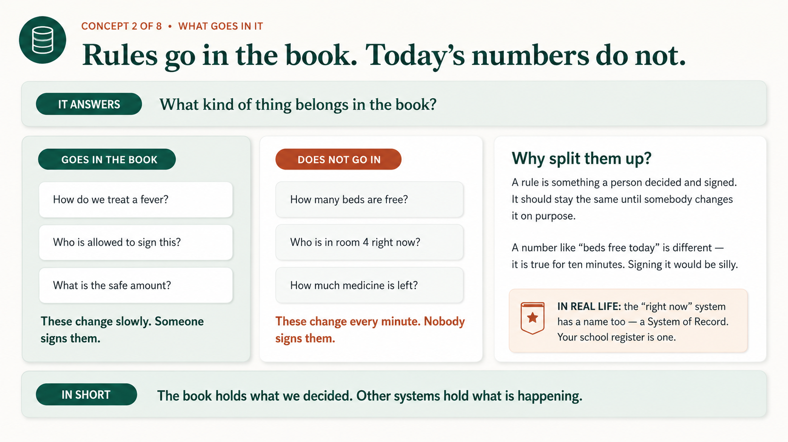

### Question

**What kind of information belongs in a KSoR?**

The simplest answer is:

> **Governed knowledge belongs in the KSoR. Rapidly changing operational state does not.**

For example:

- "What dosage rule is approved?" belongs in the KSoR.
- "How many beds are available right now?" does not.

Why?

Because the dosage rule is something the organization deliberately:

- decides,
- reviews,
- approves,
- versions,
- and expects people to follow.

The number of available hospital beds changes continuously.

That belongs in an operational system.

---

### A simple test

Ask:

> **Is this something the organization decides, reviews, approves, versions, and expects humans or agents to follow?**

If the answer is yes, it is probably a good candidate for the KSoR.

If it is a rapidly changing operational fact, it probably belongs in a traditional System of Record.

| Question | Where it belongs |
| --- | --- |
| What is our medication dosage policy? | KSoR |
| How many beds are available right now? | Operational SoR |
| What is our capitalization policy? | KSoR |
| What is the current ledger balance? | Accounting SoR |
| What is the grading policy for this course? | KSoR |
| Which students are currently enrolled? | Student information system |

The important distinction is not:

**text versus database**

The distinction is:

**governed knowledge versus operational state**

This prevents the KSoR from becoming another ERP or transactional database.

### Principle

> **The book holds what we decided. Other systems hold what is happening.**

---

## Concept 3 — Stamps

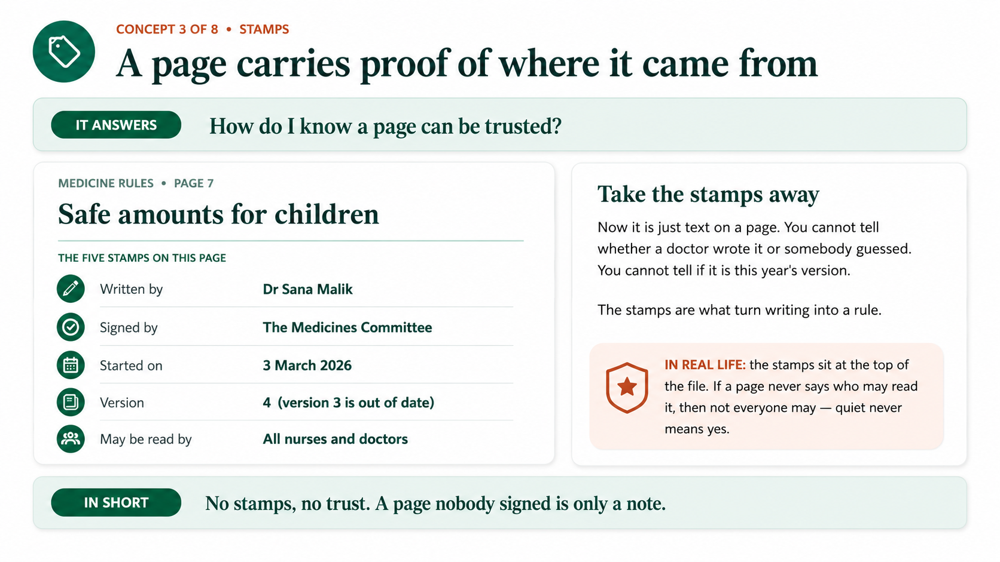

### Question

**How do I know a page can be trusted?**

Imagine a hospital policy page contains these facts:

- **Written by:** Dr Sana Malik
- **Approved by:** Medicines Committee
- **Effective from:** 3 March 2026
- **Version:** 4
- **Audience:** Nurses and doctors

Those facts are like stamps on the page.

Without them, you only have some text.

You do not know:

- who wrote it,
- who approved it,
- whether it is current,
- whether it has been replaced,
- or who is allowed to use it.

The governance information turns ordinary writing into controlled institutional knowledge.

---

### In KSoR

Each governed concept can carry metadata such as:

- ownership,
- approval authority,
- lifecycle status,
- effective date,
- version,
- audience,
- source,
- provenance.

The KSoR validates this metadata against its governance policy.

That means governance can be mechanically checked rather than existing only as informal documentation.

There is also an important security rule:

> If a page does not say who may read it, that does not mean everyone may read it.

In other words:

> **Quiet never means yes.**

### Principle

> **No stamps, no trust. A page nobody signed is only a note.**

---

## Concept 4 — The door

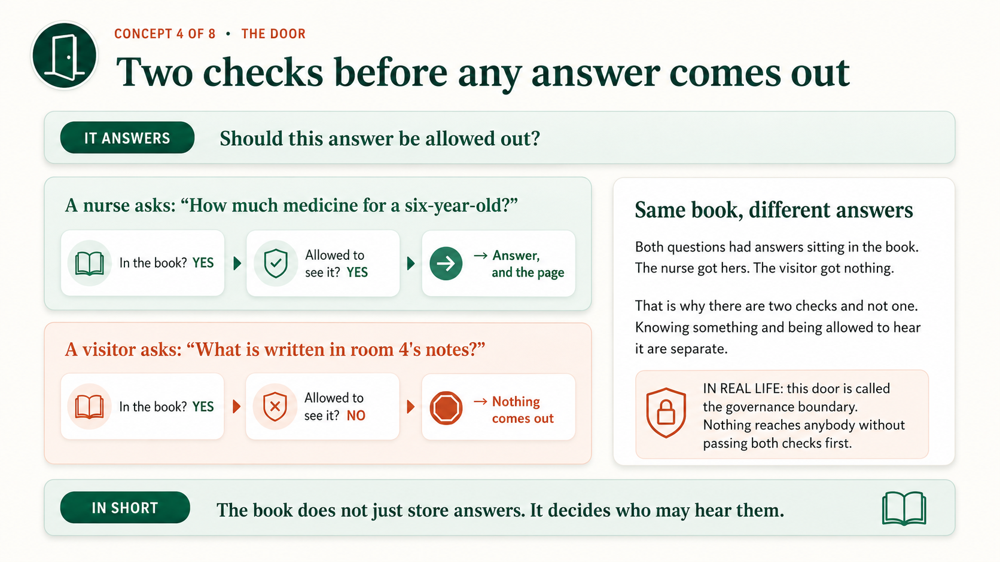

### Question

**Should this answer be allowed out?**

Finding information and being allowed to disclose it are two different things.

Imagine a nurse asks:

> "What is the approved dosage?"

The information exists.

The nurse is allowed to see it.

So the system returns the answer.

Now imagine a visitor asks:

> "What is written in the private notes for the patient in room 4?"

The information might exist.

But the visitor is not allowed to see it.

So the system returns nothing.

The important point is:

> **The system may know something without being allowed to disclose it.**

---

### In KSoR

This is the **governance boundary**.

Governance information such as:

- audiences,
- ownership,
- approval,
- and takedown authority

lives in:

```text
.ksor/governance.yaml
```

In the architecture, identity comes from OAuth/OIDC.

Then KSoR applies the governance rules.

A core rule is:

> **No knowledge crosses a serving or publication boundary without first passing the applicable governance decision.**

This matters even if the search system is technically excellent.

A very fast search engine operating over ungoverned knowledge simply retrieves ungoverned knowledge faster.

### Principle

> **The book does not just store answers. It decides who may hear them.**

---

## Concept 5 — "I don't know"

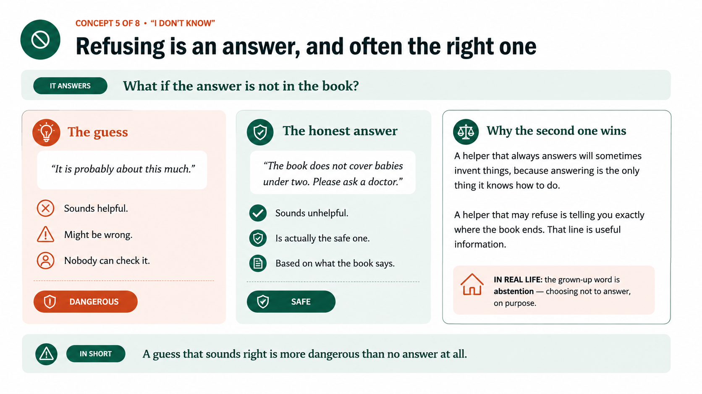

### Question

**What happens when the answer is not in the governed record?**

Suppose the hospital KSoR contains medication rules for children over two years old.

But it contains no approved dosage rule for infants.

An unsafe AI might say:

> "It is probably about this much."

That answer may sound helpful.

But it is a guess.

The governed response is:

> **"The Knowledge System of Record does not contain enough information to answer this."**

The agent can then escalate the situation to the appropriate person or workflow.

This ability to refuse to answer is called **abstention**.

---

### Why abstention matters

An AI system that is expected to answer every question will eventually invent answers.

An AI system that is allowed to say:

> "I don't know based on the approved knowledge"

makes the boundary of organizational knowledge visible.

That boundary is valuable information.

### In KSoR

**Abstention is a first-class feature, not a failure mode.**

### Principle

> **A guess that sounds right is more dangerous than no answer at all.**

---

## Concept 6 — Show the page

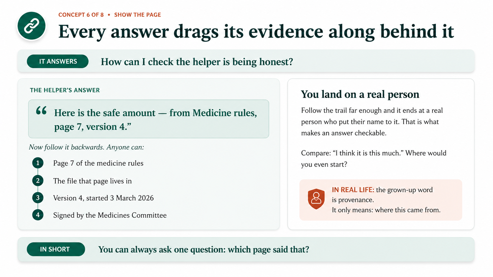

### Question

**How can I verify the answer?**

An important AI answer should not appear without evidence.

Instead of only saying:

> "Here is the safe amount."

the system should be able to say something like:

> "Here is the safe amount — from Medicine Rules, page 7, version 4."

Now someone can follow the evidence backwards.

They can inspect:

1. the AI answer,
2. the passage used,
3. the knowledge document,
4. its version,
5. the source,
6. the approval,
7. and eventually the person or authority responsible for it.

This is far more useful than:

> "I think this is correct."

---

### In KSoR

The technical term is **provenance**.

The trace can run from:

**AI answer → retrieved passage → knowledge document → build → git commit → reviewed source**

This makes the answer inspectable.

### Principle

> **Citation before confidence. A fluent answer is not evidence; a traceable answer can be inspected.**

---

## Concept 7 — Getting a page into the book

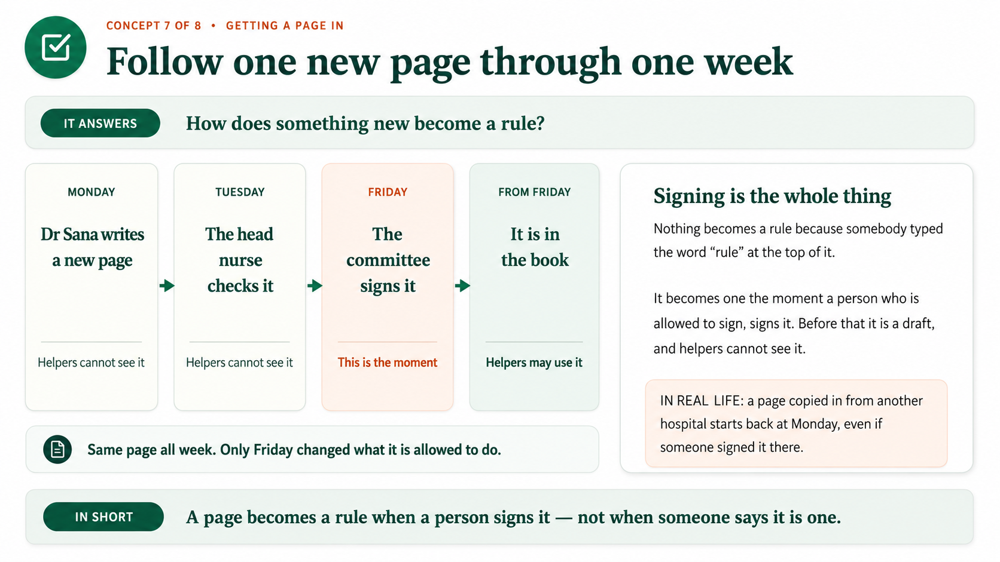

### Question

**How does new knowledge become authoritative?**

Imagine Dr Sana writes a new medication policy on Monday.

Does that make it official?

No.

On Tuesday, the head nurse reviews it.

Is it official now?

Still no.

On Friday, the authorized committee approves it.

Now something important has changed.

The text may be identical to what existed on Monday.

But its **authority** is different.

From Friday onward, the AI helpers may use it as governed knowledge.

---

### Storage does not create authority

A document does not become official because:

- somebody uploaded it,
- somebody copied it,
- someone put "POLICY" at the top,
- or it exists in a database.

It becomes authoritative through an approved governance process.

---

### In KSoR

Approval is an authority event recorded through change control.

`stable` is the lifecycle state that may be served.

These are intentionally separate ideas.

Imported knowledge also does not automatically inherit authority.

If one hospital copies a policy from another hospital, the copied policy does not automatically become authoritative in the new hospital.

The receiving organization must govern it for itself.

### Principle

> **Knowledge becomes authoritative through governance, not through storage.**

---

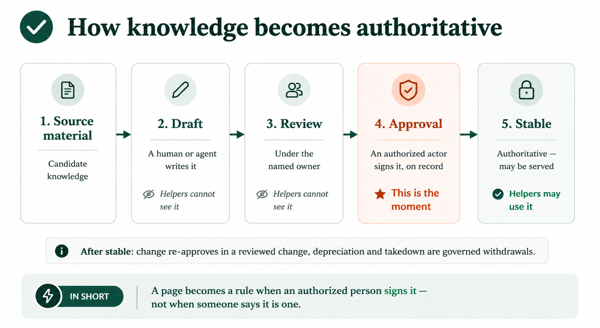

---

## Concept 8 — Many doors, one book

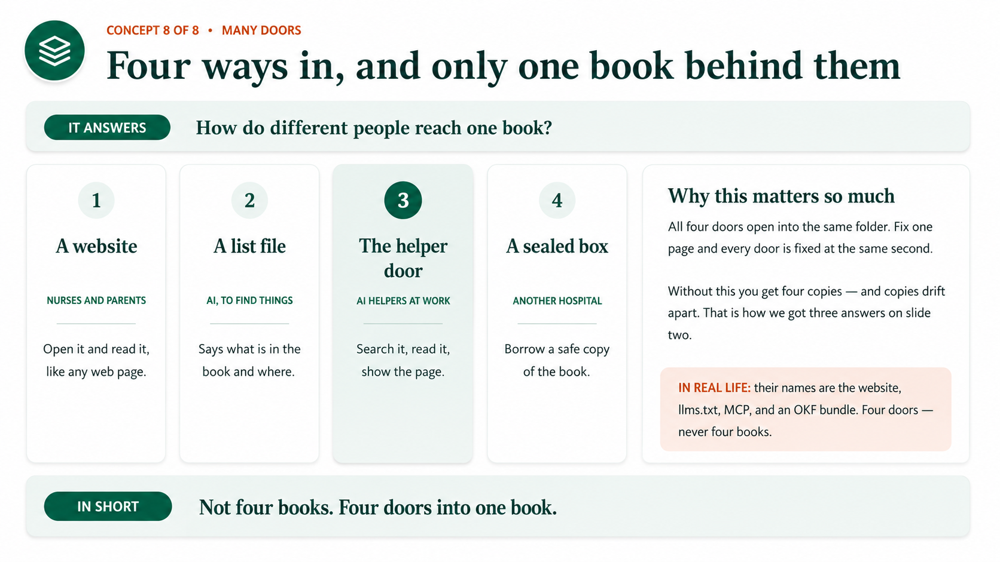

### Question

**How can different users and systems access the same knowledge?**

Different consumers need different interfaces.

A human may want a website.

An AI system may want a machine-readable discovery file.

An AI agent may want an MCP interface.

Another organization may need a safe packaged copy.

That does **not** mean you should maintain four separate knowledge bases.

Instead, you maintain:

> **One governed record with multiple projections.**

Think of it as one book with several doors.

For example:

- a **website** for humans,
- a **list file** that lets AI discover available knowledge,
- an **agent interface** for searching, reading, citing, and abstaining,
- a **portable package** for exchanging governed knowledge with another system.

All of those surfaces come from the same authoritative record.

---

### Why this matters

Suppose you discover an error.

You correct the authoritative knowledge once.

After the relevant projections are refreshed or republished, every interface receives the correction.

Without this model, you may end up maintaining:

- one copy for the website,
- one for the chatbot,
- one for an agent,
- and another for another application.

Eventually those copies drift apart.

That brings us back to the original problem:

**three AI helpers, three different answers.**

### In KSoR

These different access methods are **projections** of the governed record.

### Principle

> **Not four books. Four doors into one book. Govern knowledge once — project it many ways.**

---

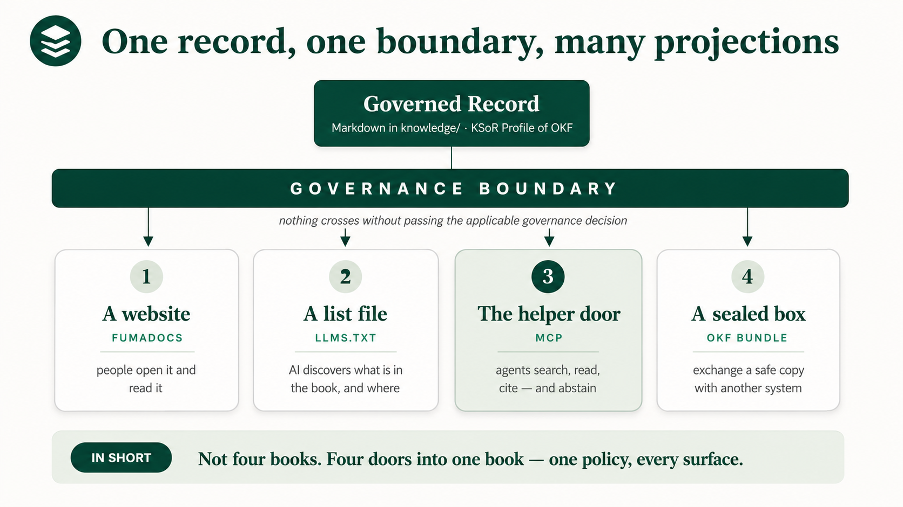

---

# 6. The trust ladder: every door does not provide the same guarantee

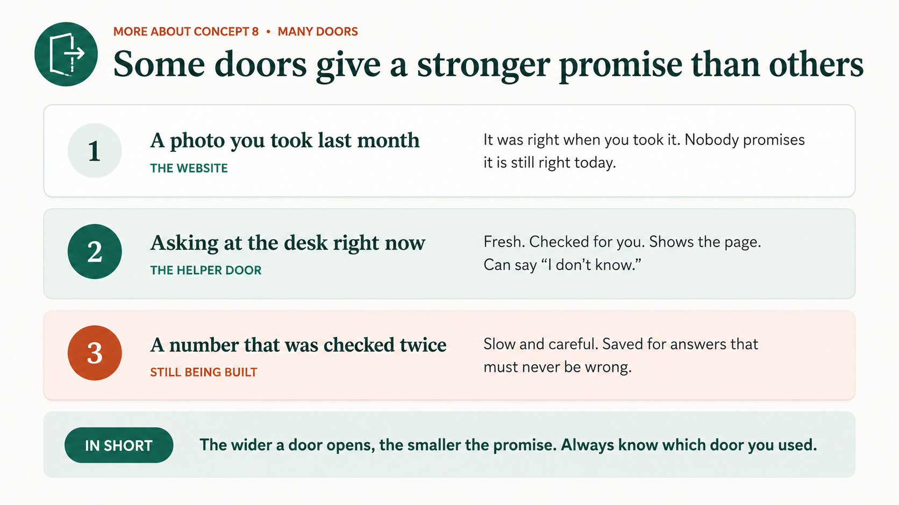

Concept 8 introduced multiple ways of accessing the same governed knowledge.

But those access methods do not all provide the same level of control.

KSoR makes that trade-off explicit.

A simple way to understand it is as a **trust ladder**.

> **The wider the reach, the weaker the guarantees.**

---

## Rung 1 — Discovery

Examples include:

- the website,
- `llms.txt`,
- per-page Markdown.

These surfaces have the broadest reach.

The content passed through governance when it was published.

But once an external AI system reads that material, KSoR cannot control what the external system does with it afterward.

Think of it like taking a photograph.

The photograph may have been accurate when it was taken.

That does not guarantee it represents the current situation forever.

---

## Rung 2 — Governed interaction

This is the MCP level.

Here the agent interacts directly with the governed system.

Retrieval can be governance-filtered before ranking.

Results can be:

- cited,
- pinned to a published generation,
- and subject to abstention rules.

This is more like asking the official desk for the answer right now.

---

## Rung 3 — Computation attestation

This is proposed and experimental.

It is intended for specific critical computations.

For example, a number might only be displayed if it was:

1. produced using the sanctioned computation,
2. mechanically checked,
3. and verified successfully.

Otherwise, it is not shown.

---

## Choosing the correct rung

The organization decides which knowledge requires which level of guarantee.

The tooling does not make that business or governance decision for you.

A KSoR should state what each access surface guarantees instead of pretending that every access method provides identical control.

### Principle

> **The wider a door opens, the smaller the promise. Always know which door you used.**

---

# 7. KSoR does not make an LLM deterministic

This distinction is very important.

KSoR does **not** turn a Large Language Model into a deterministic program.

The model may still:

- phrase an answer differently,
- choose different examples,
- follow different reasoning paths,
- adjust the level of detail,
- adapt to the user,
- or explain the same concept in different ways.

That variability can be useful.

KSoR controls something different.

It controls the **knowledge authority around the model**.

For example:

- Which source is authoritative?
- Which version is current?
- Who owns it?
- Who approved it?
- Who may see it?
- What may be retrieved?
- What evidence supports it?
- When must the system abstain?

You can think of KSoR as putting the model inside a governed **envelope**.

The reasoning can vary.

The authoritative knowledge boundary should not.

---

## Example: education

A tutor can personalize:

- explanations,
- examples,
- language,
- pacing,
- difficulty,
- exercises,
- practice.

But it should not freely change:

- learning objectives,
- canonical definitions,
- prerequisites,
- course sequence,
- approved sources,
- assessment rules,
- or the current curriculum version.

> **Personalization should vary the teaching path, not the authoritative curriculum. It can teach you your way. It cannot change what is true.**

The same idea applies inside a business.

An agent's reasoning or wording may vary.

The organization's approved policy should not change from one invocation to the next.

---

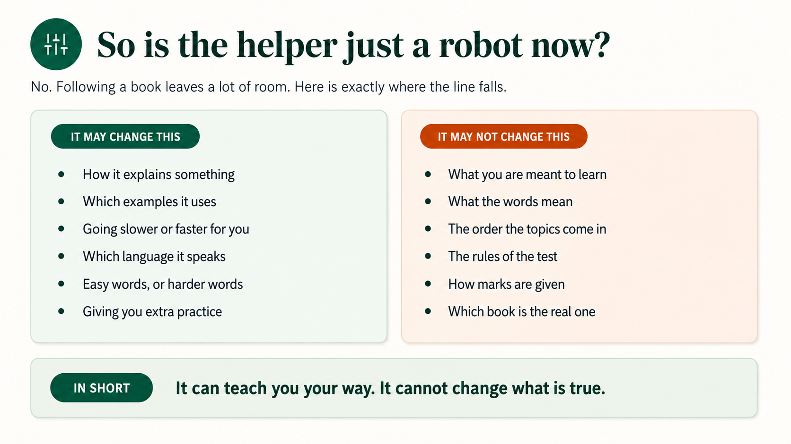

---

# 8. Major use cases

Where might you use a KSoR?

Three broad categories cover many situations.

---

## Enterprise

Imagine an accounting agent receives a $42,000 software implementation cost.

The agent must determine whether the cost can be capitalized.

It needs two kinds of information.

### From the KSoR

The governed accounting knowledge:

- capitalization policy,
- definitions,
- approval criteria,
- exceptions,
- accounting methods.

### From traditional Systems of Record

The operational facts:

- invoice,
- ledger,
- transaction data,
- vendor information,
- current balances.

The agent combines:

> **governed rules + current facts**

It then applies the policy and cites the rule it used.

If the approved policy does not cover the situation, the agent should abstain rather than inventing a policy.

---

### The Forward Deployed Engineer example

This is also useful for understanding the work of a Forward Deployed Engineer.

Imagine an FDE enters a bank to build an AI worker for credit approval.

Before building the agent, the FDE needs to understand and govern the bank's credit knowledge:

- rules,
- thresholds,
- analysis methods,
- approval requirements,
- exceptions.

That becomes the credit Knowledge SoR.

Without a governed knowledge layer, even a highly capable digital twin of an expert may give different answers because its knowledge is scattered across many sources and no source has been declared authoritative.

---

## Education

An education KSoR can govern:

- curriculum,
- learning objectives,
- canonical explanations,
- sequencing,
- assessment rules,
- grading rules.

Several AI tutors can then personalize how they teach while staying inside the same academic truth.

Panaversity's own [Agent Factory](https://agentfactory.panaversity.org/) is the working example, paired with a learner SoR that tracks each student's progress.

---

## Vertical KSoRs

A KSoR can be built for a specific profession or industry.

Examples include:

- accounting,
- government contracting,
- healthcare,
- legal,
- banking,
- insurance,
- supply chain,
- sales.

A **Vertical KSoR** is not a different type of technology.

It is simply a KSoR whose authoritative scope is a particular domain.

---

## Method KSoRs

A KSoR can also govern a reusable method.

For example:

- a design system,
- API standards,
- an operating model,
- an engineering method.

Agents can then combine several KSoRs.

For example:

> **The Method KSoR tells the agent how to work.**

while:

> **The Vertical KSoR tells the agent what is authoritative in the domain.**

This allows governed knowledge systems to be composed.

---

# 9. What KSoR is — and what it is not

Before building one, it helps to clear up four common misunderstandings.

---

## KSoR is more than RAG

RAG usually asks:

> **How can I retrieve relevant information and place it into the model's context?**

KSoR asks a different question:

> **What knowledge is authoritative enough that the organization permits humans, AI agents, and software to operate from it?**

A vector database can find similar chunks of text.

But similarity search does not establish:

- ownership,
- approval,
- lifecycle,
- audience,
- provenance,
- authority,
- or abstention rules.

RAG can therefore be a retrieval component **inside** a KSoR.

But RAG itself is not the KSoR.

The same is true of:

- a wiki,
- a CMS,
- a document repository,
- an MCP wrapper.

See [KSoR and RAG](../../README.md#ksor-and-rag).

---

## KSoR does not replace operational Systems of Record

Your existing systems still have important jobs.

Your:

- CRM,
- ERP,
- HRIS,
- accounting system,
- student information system

remain authoritative for their operational state.

KSoR adds another layer:

> **the governed knowledge that explains how to interpret that state and what to do with it.**

---

## KSoR is open, vendor-neutral infrastructure

The reference architecture separates responsibilities so that institutional knowledge does not depend completely on one vendor.

The architecture can be summarized in ten lines:

> **Markdown is the authoritative medium.**
>
> **OKF makes that record open and portable.**
>
> **KSoR governance makes it authoritative.**
>
> **Postgres + pgvector make it retrievable.**
>
> **Fumadocs serves humans.**
>
> **`llms.txt` lets AI discover it.**
>
> **MCP lets agents interact with it.**
>
> **OAuth/OIDC establishes identity; KSoR governs access.**
>
> **SLSA/Sigstore proves what was published.**
>
> **OpenTelemetry tells us what happened.**

This describes the KSoR architecture.

How much of this architecture the current beta implements is recorded in [`docs/status.md`](../status.md).

The named technologies are replaceable reference bindings.

The essential part is the governance semantics:

> **One policy, every surface.**

For more detail, see [The Nine Responsibilities](../../README.md#the-ksor-framework-nine-responsibilities) and the [KSP-001 standard proposal](../../research/).

---

## Knowledge as Code

The authoritative record is Markdown stored in Git.

That allows knowledge governance to use familiar engineering capabilities such as:

- history,
- authorship,
- diffs,
- pull requests,
- approvals,
- releases,
- rollback,
- reproducible builds.

This does **not** mean policy owners have to become software engineers.

The goal is to make institutional knowledge:

- readable,
- inspectable,
- reviewable,
- versioned,
- portable,
- and automatable.

The knowledge remains knowledge.

It is simply stored in a form that both humans and machines can manage.

---

# 10. Run your first KSoR

Now we will create a small KSoR locally.

You need **Node.js 24 or newer**.

Check your installed version:

```bash
node --version
```

The examples below use **pnpm**.

If you use npm, replace the first command with:

```bash
npx @panaversity/ksor init …
```

and later use:

```bash
npm install
npm run dev
```

If you use Bun, use:

```bash
bunx …
bun install
bun run dev
```

---

## Create the project

Run:

```bash
pnpm dlx @panaversity/ksor init my-knowledge-sor
cd my-knowledge-sor
pnpm install
pnpm dev
```

Then open:

```text
http://localhost:3000
```

You now have a working KSoR project.

You should see a human-readable knowledge website.

When you edit Markdown files inside:

```text
knowledge/
```

the site reloads with your changes.

The generated project is ordinary source code that you own.

Nothing is downloaded at build time, and nothing phones home.

---

## The important next step

Creating the project is not what makes it a real KSoR.

You now need to define:

> **What knowledge is this KSoR authoritative for?**

Open the project in the coding agent you already use.

For example:

- Claude Code,
- Cursor,
- Copilot,
- or another coding agent.

Tell the agent what the knowledge base is for.

The project includes:

```text
AGENTS.md
```

which contains the working rules for the agent.

The agent will interview you and help replace the placeholder information in:

```text
instance.md
```

Day to day, you can write your knowledge in ordinary Markdown and in whatever human language you normally use.

The coding agent can help with the structure and checks around it.

---

## Two commands you should know

Run:

```bash
pnpm check
```

before sharing a change.

This validates your knowledge files.

Run:

```bash
pnpm build
```

to build the static site.

The output goes into:

```text
system/site/out/
```

---

## Understand the project structure

Your project looks roughly like this:

```text
my-knowledge-sor/
│
├── knowledge/              # authoritative governed record
├── .ksor/
│   └── governance.yaml     # audiences, ownership, approval, takedown
├── system/
│   └── site/               # reference human projection (Next.js + Fumadocs)
├── .agents/
│   └── skills/             # skills for coding agents
├── AGENTS.md               # working constitution agents read first
└── instance.md             # what this KSoR is authoritative for
```

Let's understand each part.

### `knowledge/`

This is the authoritative governed record.

The knowledge is:

- readable by humans,
- diffable through Git,
- usable by agents.

---

### `.ksor/governance.yaml`

This contains the portable governance policy.

It can define things such as:

- audiences,
- ownership,
- approval,
- takedown authority.

The publisher validates the knowledge against this policy.

---

### `instance.md`

This defines the identity and authoritative scope of the KSoR.

In simple language, it answers:

> **What is this KSoR the official knowledge source for?**

---

### `system/site/`

This is the human-readable projection of the knowledge.

It is **not** another source of truth.

The source of truth remains the governed record.

---

### `AGENTS.md` and `.agents/`

These files help coding agents maintain the project.

They are maintenance infrastructure.

They are **not** authoritative institutional knowledge.

That distinction is important.

---

# 11. Your first exercise

Do not start by trying to model an entire company.

Start with one small knowledge boundary.

For example:

> **Employee Expense Approval KSoR**

First, edit:

```text
instance.md
```

and clearly define the scope.

Then identify three to five pieces of governed knowledge.

For example:

- meal expense limit,
- travel approval rule,
- hotel limit,
- approval threshold,
- exception procedure.

---

## Ask seven governance questions

For every knowledge concept, ask:

1. **Who owns this knowledge?**
2. **What source supports it?**
3. **Who may approve it?**
4. **Who may read it?**
5. **When does it become effective?**
6. **What happens when it changes?**
7. **What should the agent do if the rule does not cover a situation?**

These questions force you to think beyond simply writing documents.

You are defining the authority around the knowledge.

---

## Add the knowledge

Use the scaffold and its agent instructions to create the knowledge in the format expected by the current release.

Then validate it:

```bash
pnpm check
```

Then build it:

```bash
pnpm build
```

You have now crossed an important architectural boundary.

Before, you had:

> **some documents an AI might read**

Now you are beginning to define:

> **the knowledge your organization declares authoritative**

That is the important shift.

---

## Later: serve the record directly to AI agents

The human website is only one projection of the KSoR.

Later, you may want AI agents to query the KSoR directly through MCP.

That allows features such as:

- governed retrieval,
- citations,
- abstention.

To do that, you add:

- Postgres,
- pgvector,
- an embedding key.

Then run:

```bash
pnpm provision
```

once to provision the infrastructure.

Use:

```bash
pnpm refresh
```

to publish the knowledge.

Then use:

```bash
pnpm serve
```

to serve it.

These commands are deliberately separate.

Why?

Because:

> **Publishing institutional truth should be a deliberate event, not an accidental side effect of starting a server.**

The full walkthrough is in [Serve to AI Agents](../../README.md#serve-to-ai-agents), and it is the subject of a later tutorial in this series.

> **Status note:** KSoR is in active development (beta). [`docs/status.md`](../status.md) is always authoritative for what the current release supports. Star and watch the [repo](https://github.com/panaversity/ksor) to follow along.

---

# 12. The mental model to remember

There are many technical details in KSoR.

But if you are a beginner, remember these four ideas first.

## 1. Decide which pages are real

Your organization must explicitly decide which knowledge is authoritative.

---

## 2. Make every AI helper answer from those pages

Do not allow every AI system to choose its own institutional truth.

---

## 3. Make the AI show you the page

Important answers should be connected to the knowledge that supports them.

That makes them traceable and inspectable.

---

## 4. Let the AI say "I don't know"

If the authoritative knowledge does not contain an answer, the AI should not invent one.

Abstention is safer than a confident guess.

---

Return to our hospital example.

At the beginning, three AI helpers gave three different answers.

After the hospital establishes its governed knowledge, the nurse asks the same question again.

Now all three helpers can point to the same authoritative rule:

> *Medicine Rules, page 7, version 4.*

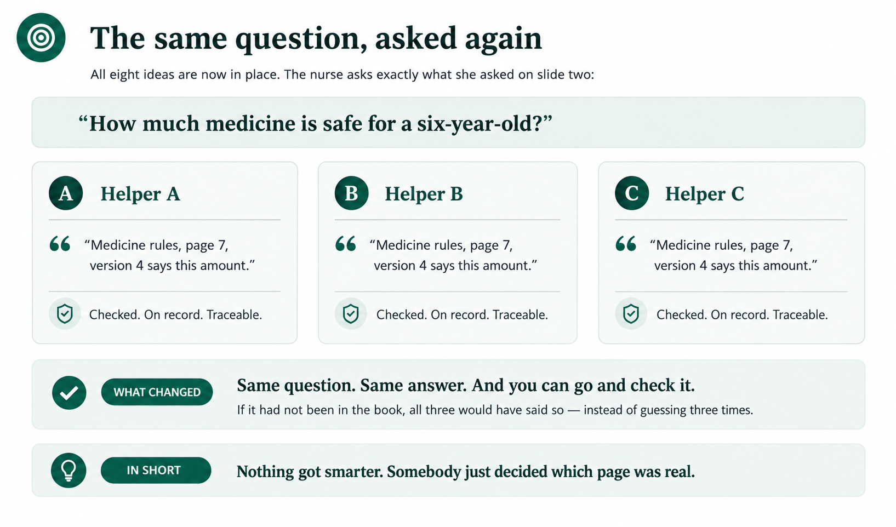

The important change was not that the AI suddenly became smarter.

The organization decided which knowledge was authoritative.

> **Nothing got smarter. Somebody just decided which page was real.**

The architecture in one line is:

> **One authoritative record. One governance boundary. Many open projections.**

And the operating principle is:

> **Govern knowledge once. Project it many ways.**

---

# 13. Where to go next

After completing this tutorial, useful next tutorials would be:

1. **Build a Real Governed KSoR** — take the small exercise from section 11 further: grow it into a real corpus, apply governance metadata properly, resolve a conflict between two concepts, and publish the human site for others to use.

2. **KSoR Governance in Practice** — ownership, audiences, approvals, lifecycle states, effective dates, takedown, and fail-closed behavior.

3. **Serve a KSoR to AI Agents with MCP** — provision Postgres + pgvector, publish a generation, connect an MCP client, retrieve citations, and test abstention.

4. **Combine KSoR with Traditional Systems of Record** — build an agent that combines governed policy with current operational facts from an ERP, CRM, or accounting system.

5. **Exchange Governed Knowledge with OKF** — package and move governed knowledge between knowledge systems without creating a second source of truth.

---

## Related material

- Repository README: [`../../README.md`](../../README.md)
- Current implementation status: [`../status.md`](../status.md)
- KSoR repository: [https://github.com/panaversity/ksor](https://github.com/panaversity/ksor)
- Introductory presentation video: [https://www.youtube.com/watch?v=EeTGuQJbHCg](https://www.youtube.com/watch?v=EeTGuQJbHCg)

---

## Final thought

AI models are extraordinarily capable at reasoning over information.

But **reasoning capability** and **institutional authority** are not the same thing.

The model can help determine:

> **What follows from a rule?**

But the organization must still decide:

> **Which rule is the rule?**

That is the role of a **Knowledge System of Record**.
